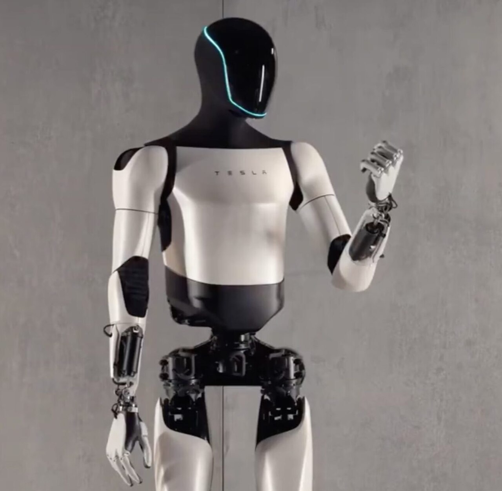
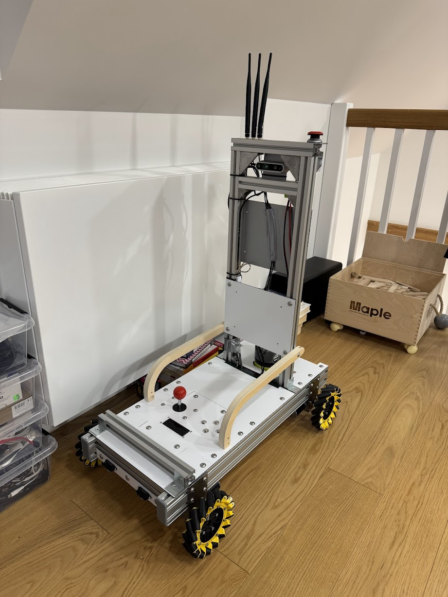

# Photo Download Links for Kindergarten Robot Presentation 📸

This file contains links to download all the photos needed for the "Amazing Robots!" presentation. After downloading, place them in the `images/` folder within this directory.

## Images to Download

### 1. Roomba Robot Vacuum Cleaner 🌪️
**Filename**: `roomba-vacuum.jpg`
**Search terms**: "Roomba robot vacuum cleaner home"
**Suggested sources**:
- https://unsplash.com/s/photos/roomba-vacuum
- https://www.pexels.com/search/robot%20vacuum/
- Search for: "iRobot Roomba cleaning floor"

### 2. Robot Lawn Mower 🌱
**Filename**: `robot-lawn-mower.jpg`
**Search terms**: "Robot lawn mower cutting grass"
**Suggested sources**:
- https://unsplash.com/s/photos/robot-lawn-mower
- https://www.pexels.com/search/lawn%20mower%20robot/
- Search for: "Husqvarna Automower" or "Worx Landroid"

### 3. Pudu Bellabot Restaurant Robot 🍽️
**Filename**: `bellabot-restaurant.jpg`
**Search terms**: "Pudu Bellabot restaurant service robot"
**Suggested sources**:
- https://unsplash.com/s/photos/restaurant-robot
- Search for: "Pudu Robotics Bellabot serving food"
- Look for images of cute delivery robots in restaurants

### 4. Tesla Self-Driving Car 🚗
**Filename**: `tesla-self-driving.jpg`
**Search terms**: "Tesla Model 3 autopilot self driving"
**Suggested sources**:
- https://unsplash.com/s/photos/tesla-car
- https://www.pexels.com/search/tesla/
- Search for: "Tesla Model 3 or Model Y on road"

### 5. Tesla Optimus Humanoid Robot 🚶
**Filename**: `tesla-optimus.jpg`
**Search terms**: "Tesla Optimus humanoid robot"
**Suggested sources**:
- Search for: "Tesla Bot Optimus humanoid robot"
- Tesla official images from presentations
- Look for images of white/black humanoid robots walking

### 6. Lunar Rover on Moon 🌙
**Filename**: `lunar-rover.jpg`
**Search terms**: "Lunar rover Moon surface NASA"
**Suggested sources**:
- NASA Image Gallery: https://images.nasa.gov/
- Search for: "Lunar Reconnaissance Orbiter" or "Apollo lunar rover"
- https://unsplash.com/s/photos/moon-rover

### 7. Mars Rover Perseverance 🔴
**Filename**: `mars-rover-perseverance.jpg`
**Search terms**: "Mars Rover Perseverance NASA"
**Suggested sources**:
- NASA Image Gallery: https://images.nasa.gov/
- Search for: "NASA Perseverance Mars rover"
- NASA JPL official images

### 8. Eraccoon Robot (Already Available) 🤖
**Filename**: `eraccoon-robot.jpg`
**Source**: `../../img/IMG_1099.jpg` (already in the repository)
**Note**: Copy this file to the images folder or update the HTML to point to the correct path

## Download Instructions

1. Create an `images/` folder in this directory: `doc/pres/kindergarten/images/`
2. Download each image using the suggested search terms
3. Rename the files to match the filenames listed above
4. Save them in the `images/` folder
5. Update the HTML file to replace the photo placeholders with actual image tags

## HTML Image Tags to Replace Placeholders

Once you have the images, replace each `<div class="photo-placeholder">` with:

```html
<!-- Roomba -->


<!-- Robot Lawn Mower -->


<!-- Bellabot -->


<!-- Tesla -->


<!-- Tesla Optimus -->


<!-- Lunar Rover -->


<!-- Mars Rover -->


<!-- Eraccoon Robot -->

```

## Alternative Free Image Sources

- **Unsplash**: https://unsplash.com/ (free high-quality photos)
- **Pexels**: https://www.pexels.com/ (free stock photos)
- **NASA Image Gallery**: https://images.nasa.gov/ (free space photos)
- **Pixabay**: https://pixabay.com/ (free images)
- **Wikipedia Commons**: https://commons.wikimedia.org/ (free educational images)

## Presentation Features

This presentation is designed specifically for 4-year-old kindergarten children with:
- ✅ Large, kid-friendly fonts (Comic Sans MS)
- ✅ Lots of emojis and visual elements
- ✅ Simple, clear language
- ✅ Bright, engaging colors
- ✅ Interactive questions
- ✅ Touch-friendly navigation for tablets

## How to Present

1. Open `index.html` in a web browser
2. Use arrow keys or click to navigate between slides
3. Perfect for tablets or interactive whiteboards
4. Encourage kids to:
   - Point out robots they recognize
   - Share stories about robots they've seen
   - Imagine their own robot creations
   - Ask questions throughout

## Customization

Feel free to:
- Add more local robot examples kids might know
- Include photos of classroom robots or coding toys
- Add your own robot building experiences
- Customize the color scheme
- Add sound effects or animations

Have fun presenting! 🎉🤖